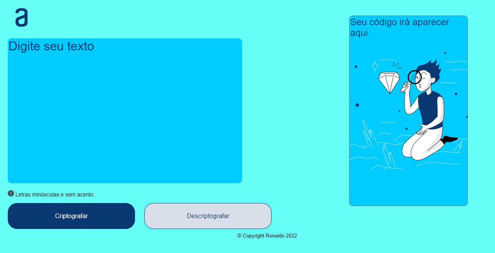

# Codificador-de-texto

Link do projeto: <https://ronaldof16.github.io/Codificador-de-texto/>

## Sobre

Esse projeto como o nome diz é um codificador e decodifcador de texto, ao inserir o texto no local indicado e clicar em codificar, 
vai aparecer o texto codificado na outra caixa que se encontra ao lado e também vai aparecr o botão de coipar o texto, depois vc tem 
a oção de decodificar.

## Competências utilizadas
* HTML
* CSS
* JavaScript

